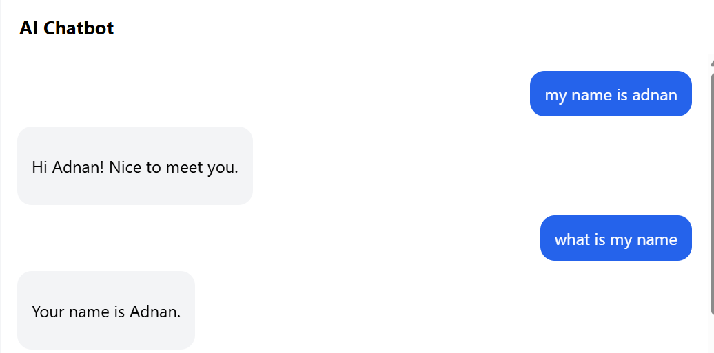
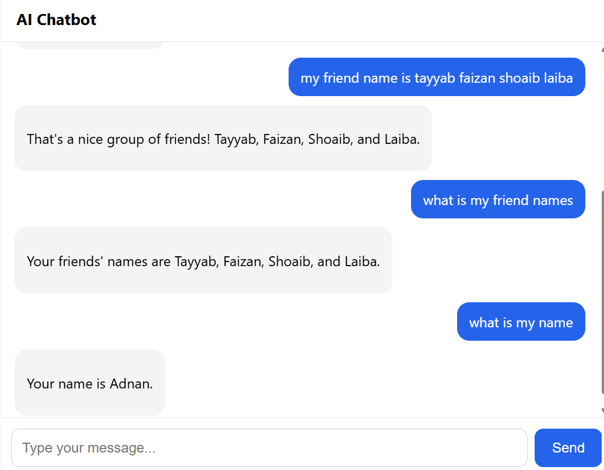

# Simple AI Chatbot

## What I built
A web-based AI chatbot. The user types a message, the backend sends the
conversation to an AI model through an API, and the reply is shown in a chat page.
I also built a terminal (CLI) version in `chat.py`.

**Features:** conversation history, system prompt, loading state,
error handling with retries, Markdown responses, simple chat UI.

## Technology used
- Python, FastAPI, Uvicorn
- OpenAI Python SDK (connected to Google Gemini's OpenAI-compatible endpoint)
- HTML, CSS, JavaScript (marked + DOMPurify for safe Markdown)
- python-dotenv for secrets

## How to run
```bash
git clone https://github.com/MuhammadAdnan586/ai-chatbot.git
cd ai-chatbot
python -m venv venv
venv\Scripts\activate
pip install -r requirements.txt
```
Create a `.env` file (see `.env.example`) and add your key:
```
API_KEY=your_api_key_here
```
Run the web app:
```bash
uvicorn app:app --reload
```
Open http://127.0.0.1:8000

Or run the terminal version:
```bash
python chat.py
```

## API integration approach
1. The browser keeps the full conversation in a `history` array.
2. On send, it POSTs the history to `/chat`.
3. FastAPI adds a system prompt and calls `client.chat.completions.create(...)`.
4. If the call fails, it retries up to 3 times, then returns a friendly error.
5. The reply goes back as JSON and is rendered as Markdown.
6. The API key stays on the server in `.env` (ignored by Git), never in the browser or the repo.

## What I learned
- How to call an LLM API and use the system / user / assistant roles
- LLMs are stateless, so the full history is sent with every request
- Keeping secrets safe with `.env` and `.gitignore`
- Handling temporary API errors (like 503) with retries instead of crashing

## What I would improve next
- Stream responses token by token
- Save chat history in a database
- Add user login and rate limiting
- Add voice input and output
- Trim long histories to save tokens

## Screenshot

